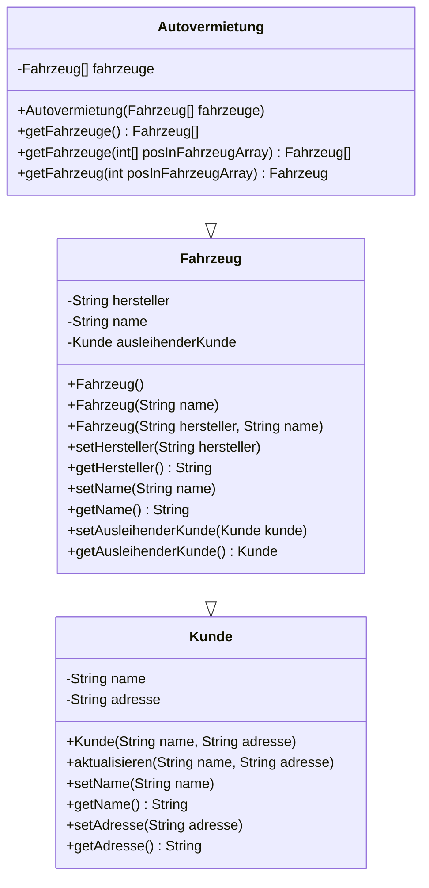

# Übungsaufgaben für die 4. Klausur

Hier findest du Übungsaufgaben für die 4. Klausur in PR1.

## Klausurthemen

- Überladen von Methoden
- Objekte in Objekte / Objektbeziehungen
- Aufzählungstypen
- Assoziationen
- Javadoc (Code-Dokumentation)
- Rekursion
- Vererbung

## Aufgabe 1: Autovermietung

Du sollst eine Software für eine Autovermietung programmieren.
Erstelle die Klassen nach folgendem Schema
und ergänze eine Klasse ```Tester```, um die Software zu testen.


