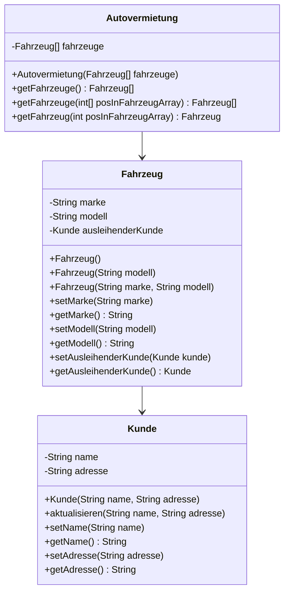

# Aufgabe 1: Autovermietung

Du sollst eine Software für eine Autovermietung programmieren.
Erstelle die Klassen nach folgendem Schema,
implementiere die hervorgehenden Funktionalitäten
und ergänze eine Klasse `Tester`, um die Software zu testen.

