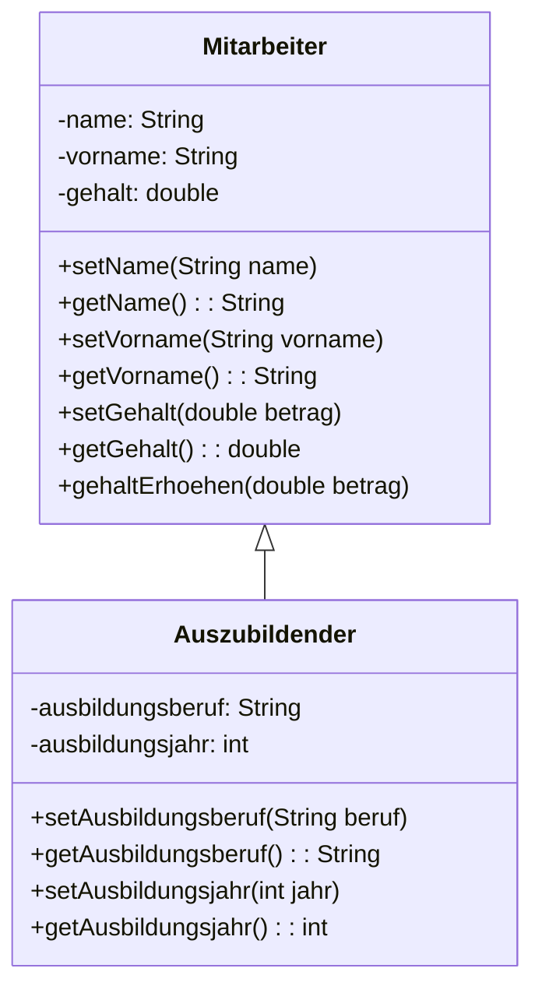

# Klassendiagramm zur Aufgabe

```mermaid
classDiagram
    class Mitarbeiter {
        -name: String
        -vorname: String
        -gehalt: double
        +setName(String name)
        +getName(): String
        +setVorname(String vorname)
        +getVorname(): String
        +setGehalt(double betrag)
        +getGehalt(): double
        +gehaltErhoehen(double betrag)
    }
    
    class Auszubildender {
        -ausbildungsberuf: String
        -ausbildungsjahr: int
        +setAusbildungsberuf(String beruf)
        +getAusbildungsberuf(): String
        +setAusbildungsjahr(int jahr)
        +getAusbildungsjahr(): int
    }
    
    Mitarbeiter <|-- Auszubildender
```
