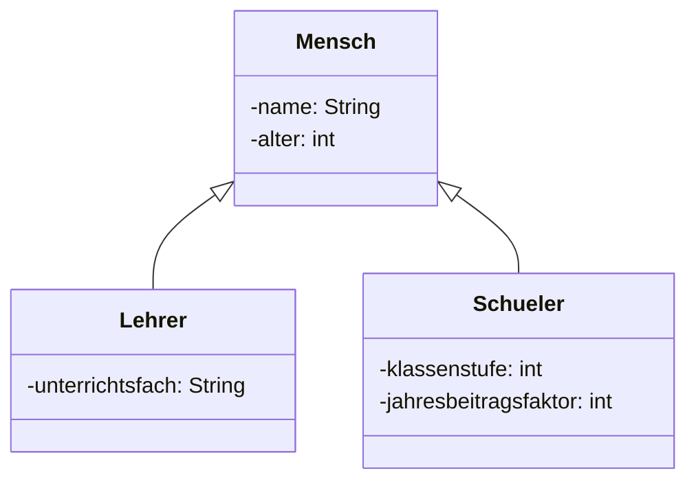

# Klassendiagramm

```mermaid
classDiagram
    class Mensch {
        -name: String
        -alter: int
    }
    
    class Lehrer {
        -unterrichtsfach: String
    }
    
    class Schueler {
        -klassenstufe: int
        -jahresbeitragsfaktor: int
    }
    
    Mensch <|-- Lehrer
    Mensch <|-- Schueler
```