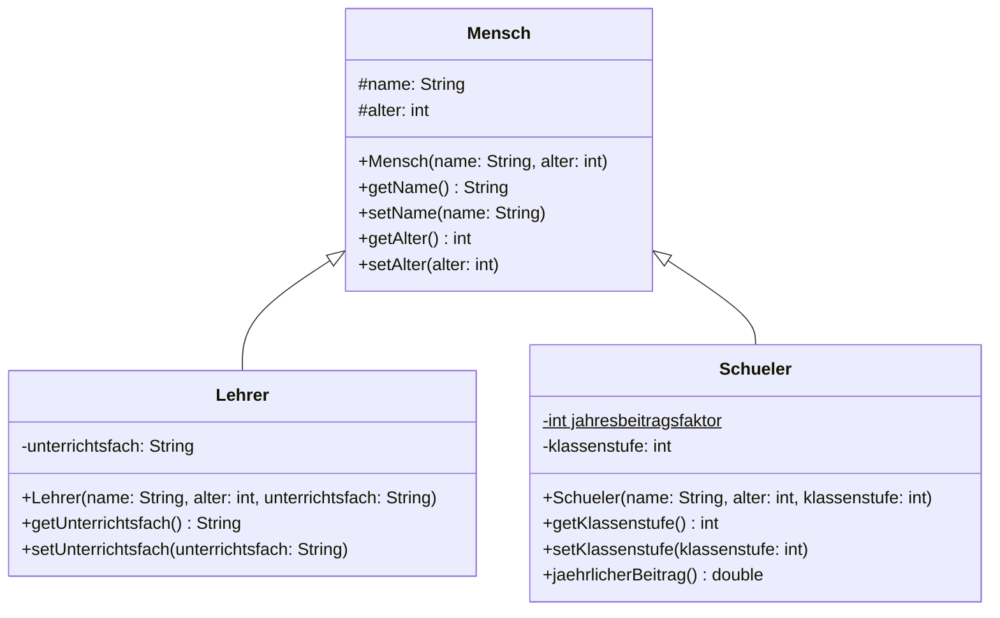

# Klassendiagramm

```mermaid
classDiagram
    class Mensch {
        #name: String
        #alter: int
        +Mensch(name: String, alter: int)
        +getName() String
        +setName(name: String)
        +getAlter() int
        +setAlter(alter: int)
    }
    
    class Lehrer {
        -unterrichtsfach: String
        +Lehrer(name: String, alter: int, unterrichtsfach: String)
        +getUnterrichtsfach() String
        +setUnterrichtsfach(unterrichtsfach: String)
    }
    
    class Schueler {
        -int jahresbeitragsfaktor$
        -klassenstufe: int
        +Schueler(name: String, alter: int, klassenstufe: int)
        +getKlassenstufe() int
        +setKlassenstufe(klassenstufe: int)
        +jaehrlicherBeitrag() double
    }
    
    Mensch <|-- Lehrer
    Mensch <|-- Schueler
```