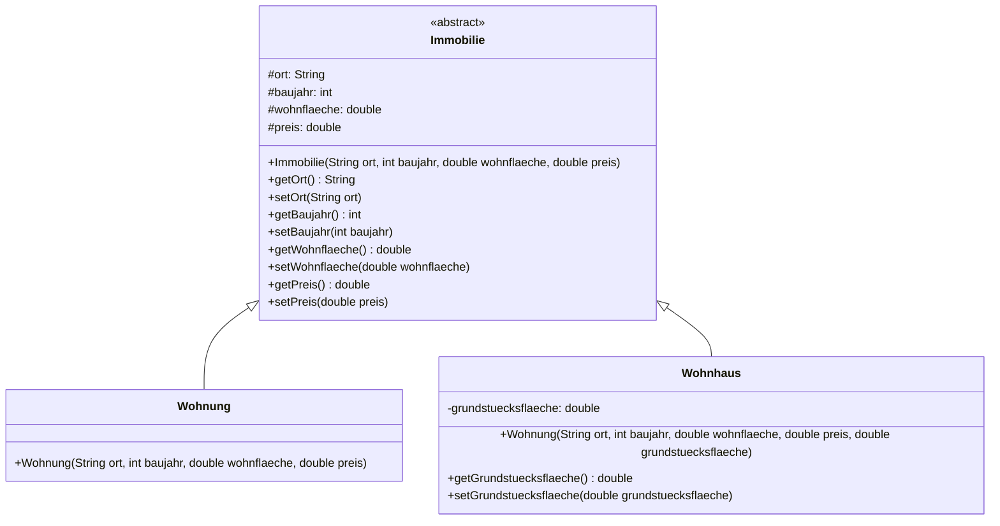

# UML-Klassendiagramm

```mermaid
classDiagram

    class Immobilie {
        #ort: String
        #baujahr: int
        #wohnflaeche: double
        #preis: double
        +Immobilie(String ort, int baujahr, double wohnflaeche, double preis)
        +getOrt() String
        +setOrt(String ort)
        +getBaujahr() int
        +setBaujahr(int baujahr)
        +getWohnflaeche() double
        +setWohnflaeche(double wohnflaeche)
        +getPreis() double
        +setPreis(double preis)
    }
    
    <<abstract>> Immobilie
    
    class Wohnung {
            +Wohnung(String ort, int baujahr, double wohnflaeche, double preis)
    }
    
    class Wohnhaus {
        -grundstuecksflaeche: double
        +Wohnung(String ort, int baujahr, double wohnflaeche, double preis, double grundstuecksflaeche)
        +getGrundstuecksflaeche() double
        +setGrundstuecksflaeche(double grundstuecksflaeche)
    }
    
    Immobilie <|-- Wohnung
    Immobilie <|-- Wohnhaus
    
```