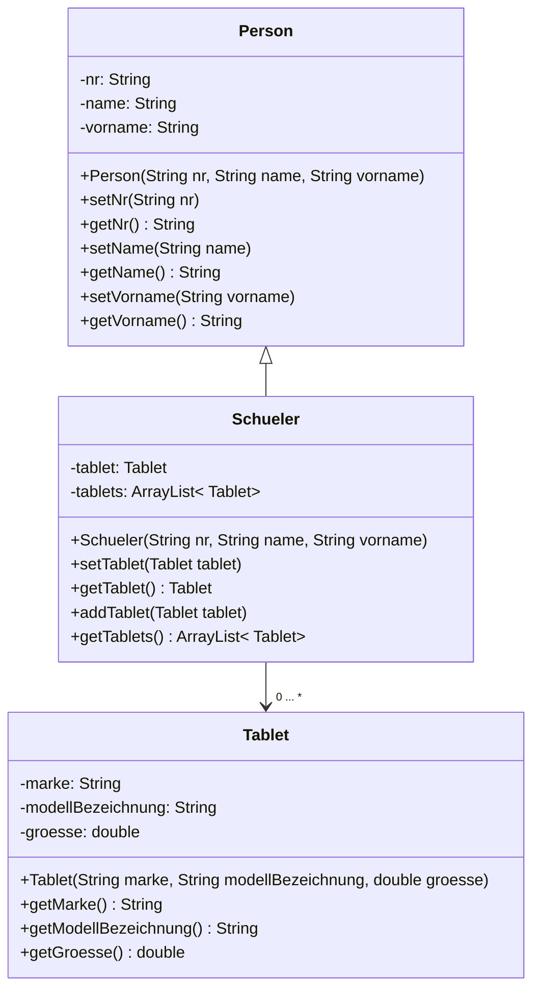

# UML-Diagramm

```mermaid
classDiagram

class Person {
    -nr: String
    -name: String
    -vorname: String
    +Person(String nr, String name, String vorname)
    +setNr(String nr)
    +getNr() String
    +setName(String name)
    +getName() String
    +setVorname(String vorname)
    +getVorname() String
}

class Schueler {
    -tablet: Tablet
    -tablets: ArrayList< Tablet>
    +Schueler(String nr, String name, String vorname)
    +setTablet(Tablet tablet)
    +getTablet() Tablet
    +addTablet(Tablet tablet)
    +getTablets() ArrayList< Tablet>
}

class Tablet {
    -marke: String
    -modellBezeichnung: String
    -groesse: double
    +Tablet(String marke, String modellBezeichnung, double groesse)
    +getMarke() String
    +getModellBezeichnung() String
    +getGroesse() double
}

Person <|-- Schueler

Schueler --> "0 ... *" Tablet

```