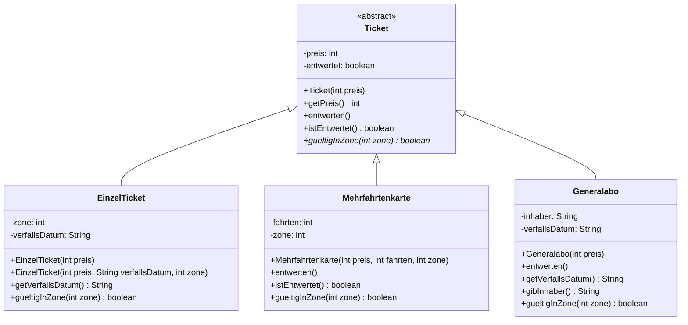

# Klassendiagramm

```mermaid
classDiagram

class Ticket {
    -preis: int
    -entwertet: boolean
    +Ticket(int preis)
    +getPreis() int
    +entwerten()
    +istEntwertet() boolean
    +gueltigInZone(int zone)* boolean
}

class EinzelTicket {
    -zone: int
    -verfallsDatum: String
    +EinzelTicket(int preis)
    +EinzelTicket(int preis, String verfallsDatum, int zone)
    +getVerfallsDatum() String
    +gueltigInZone(int zone) boolean
}

class Mehrfahrtenkarte {
    -fahrten: int
    -zone: int
    +Mehrfahrtenkarte(int preis, int fahrten, int zone)
    +entwerten()
    +istEntwertet() boolean
    +gueltigInZone(int zone) boolean
}

class Generalabo {
    -inhaber: String
    -verfallsDatum: String
    +Generalabo(int preis)
    +entwerten()
    +getVerfallsDatum() String
    +gibInhaber() String
    +gueltigInZone(int zone) boolean
}

<<abstract>> Ticket

Ticket <|-- EinzelTicket
Ticket <|-- Mehrfahrtenkarte
Ticket <|-- Generalabo
```